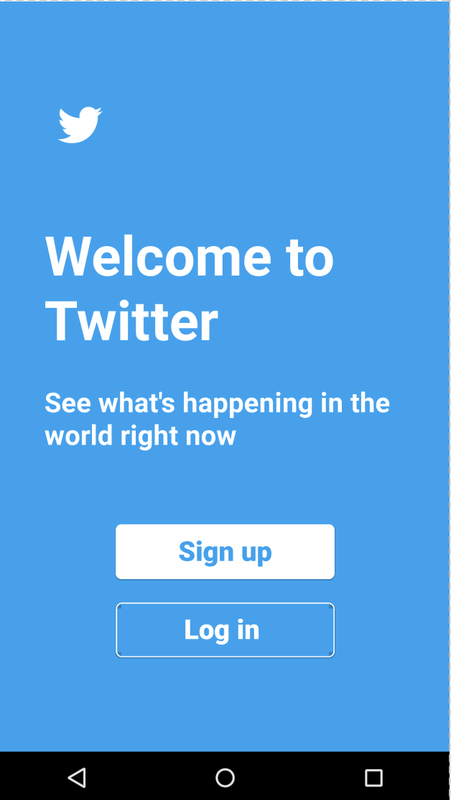

# Lab 1 - *Twitter Log in Screen Clone*

**Twitter Log in Screen Clone** is our effort to recreate the Twitter login screen in order to practice our UI/UX and Android skills.

Time spent: **1** hour spent in total

## Picture

GIF created with [LiceCap](http://www.cockos.com/licecap/).

## Notes

This looks best on Nexus 6 screen. 

Shout to Twitter for branding materials. 
